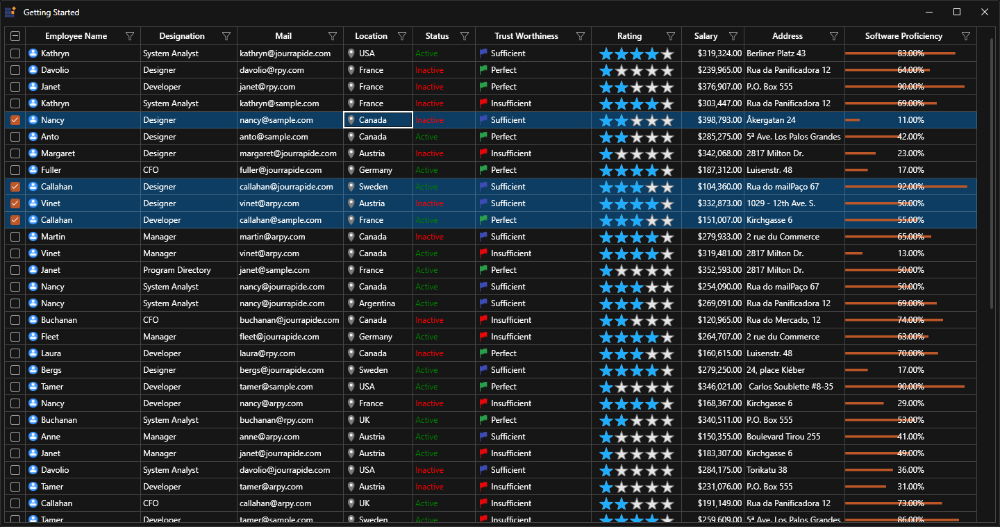

# How to customize themes using palette in WPF SkinManager?

This sample loads [Datagrid](https://help.syncfusion.com/wpf/datagrid/getting-started) and [Chromeless Window](https://help.syncfusion.com/wpf/chromeless-window/getting-started) with custom theme look using SkinManager [Theme](https://help.syncfusion.com/wpf/themes/getting-started#apply-visual-style-to-controls) and register theme settings support.

